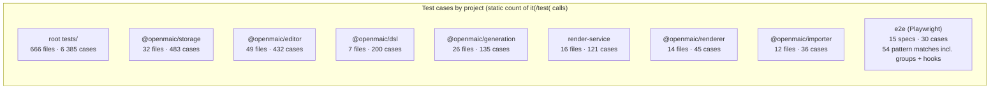

# 06 — Quality observations and measured metrics

All measurements taken at `main` / `c2c9553a` with `node_modules` **absent**.
Every number carries the command that produced it. Nothing below is estimated
unless it says "heuristic".

## Reproducibility caveat

`node_modules` was not installed during this survey
(`test -d node_modules` → absent), so no suite was executed. Every count here is
**static**: file counts, `it(`/`test(` call counts, regex densities. Runtime
figures (actual pass counts, durations, real line coverage) are listed as
unmeasurable in `07-open-questions.md`.

## Test volume



```bash
# root suite file count (exactly what vitest.config.ts collects)
find tests -name '*.test.ts' | wc -l                     # 666
find tests -name '*.test.tsx' | wc -l                    # 0
find tests -type f ! -name '*.test.ts' | wc -l           # 14 helpers/fixtures
# (with the trailing glob, ! -name '*.test.ts*', the count is 13: the pattern
#  also excludes tests/video-export/__snapshots__/emit-hyperframes.test.ts.snap)

# root suite case count
grep -rhoE "^\s*(it|test)(\.\w+)?\(" tests | wc -l       # 6385
grep -rhoE "^\s*describe(\.\w+)?\(" tests | wc -l        # 1293

# per-package
for p in dsl generation storage renderer editor importer; do
  find packages/@openmaic/$p -name '*.test.ts*' -not -path '*/node_modules/*' | wc -l
  find packages/@openmaic/$p -name '*.test.ts*' -not -path '*/node_modules/*' \
    | xargs grep -hoE "^\s*(it|test)(\.\w+)?\(" | wc -l
done
# dsl 7/200  generation 26/135  storage 32/483
# renderer 14/45  editor 49/432  importer 12/36
# (generation's find matches 28 paths; 2 are __snapshots__/*.test.ts.snap, so 26
#  are real spec files. The case counts are unaffected.)

# render-service
find render-service -name '*.test.ts' -not -path '*/node_modules/*' | wc -l   # 16
find render-service -name '*.test.ts' -not -path '*/node_modules/*' -print0 \
  | xargs -0 grep -hoE "^\s*(it|test)(\.\w+)?\(" | wc -l                      # 121

# e2e
find e2e -name '*.spec.ts' | wc -l                                            # 15
grep -rhoE "^\s*test(\.\w+)?\(" e2e/tests | wc -l                             # 54
# 54 is the total pattern-match count, not the case count. It breaks down as
# 30 plain test( + 13 test.describe( groups + 9 test.beforeEach( + 1
# test.afterEach( + 1 test.setTimeout(. The Playwright CASE count is 30:
grep -rhoE '\btest\(' e2e/tests | wc -l                                       # 30
```

**Totals: 7 837 statically-counted unit/integration cases + 30 Playwright cases
across 837 test files.** "837 test files" is the repo-wide figure — the 666 in
root `tests/`, plus 140 across the six `packages/@openmaic/*` suites, plus 16 in
`render-service`, plus the 15 Playwright specs. Where a number below is scoped to
the root suite alone it says 666. Plus 272 `it.each`/`test.each` parameterised blocks
(`grep -rhoE '\b(it|test)\.each\b' tests packages/@openmaic/*/test | wc -l`),
each of which expands to more than one runtime case, so the executed total is
strictly higher.

## Discipline markers

```bash
grep -rn -E '\b(it|test|describe)\.only\b' tests e2e packages/@openmaic/*/test | wc -l   # 0
grep -rhoE '\b(it|test|describe)\.(skip|todo|failing)\b' \
  tests packages/@openmaic/*/test render-service/src e2e | sort | uniq -c
#   5 test.skip    2 describe.skip
grep -rn 'vi.mock(' tests packages/@openmaic/*/test render-service/test | wc -l          # 707
grep -rn 'toMatchSnapshot\|toMatchInlineSnapshot\|toMatchFileSnapshot' \
  tests packages/@openmaic/*/test | wc -l                                                # 10
find . -name '*.snap' -not -path '*/node_modules/*'                                      # 3 files
```

Zero `.only` anywhere and only 7 skip markers across all 837 test files is
exceptional — note the `skip`/`todo`/`failing` grep above is scoped to `tests`,
`packages/@openmaic/*/test`, `render-service/src` and `e2e`, which is that whole
set. 707 `vi.mock` calls against 7 837 cases is heavy mocking — roughly
one module mock per eleven cases — which is the cost of unit-testing an app whose
surface is provider SDKs and a database.

Only three snapshot files exist
(`packages/@openmaic/generation/test/__snapshots__/outline-prompt.test.ts.snap`,
`.../scene-prompt-golden.test.ts.snap`,
`tests/video-export/__snapshots__/emit-hyperframes.test.ts.snap`), so the suite is
assertion-driven rather than snapshot-driven.

## Coverage: no instrumentation exists

```bash
grep -rn 'coverage' package.json packages/@openmaic/*/package.json \
  render-service/package.json vitest*.config.ts \
  packages/@openmaic/*/vitest.config.ts render-service/vitest.config.ts
# (no output)
```

No `@vitest/coverage-v8`, no `@vitest/coverage-istanbul`, no `coverage` block in
any of the nine Vitest configs, no coverage threshold, no coverage upload step in
any workflow. **Line/branch coverage is unknown and unknowable from this
checkout.**

### Heuristic proxy: module reference from test code

The proxy used instead: does any file under `tests/`, `e2e/` or
`packages/@openmaic/*/test/` mention this module's path (as `@/<path>` or as
`/<basename>'`)? This over-counts (a mention is not a test) and under-counts (a
module exercised transitively is not mentioned). Command in
`06b`-style form:

```bash
python3 - <<'PY'
import os, collections
blob=[]
for root in ['tests','e2e','packages/@openmaic']:
    for dp,dn,fn in os.walk(root):
        if 'node_modules' in dp or '/dist' in dp: continue
        for f in fn:
            if f.endswith(('.ts','.tsx')):
                blob.append(open(os.path.join(dp,f),encoding='utf-8',errors='ignore').read())
blob='\n'.join(blob)
def cov(root, depth):
    g=collections.defaultdict(lambda:[0,0])
    for dp,dn,fn in os.walk(root):
        if 'node_modules' in dp or '/dist' in dp: continue
        for f in fn:
            if not f.endswith(('.ts','.tsx')): continue
            p=os.path.join(dp,f); mod=p.rsplit('.',1)[0]
            key=os.sep.join(p.split(os.sep)[:depth]); g[key][0]+=1
            base=os.path.basename(mod)
            if f'@/{mod}' in blob or f"/{base}'" in blob or f'/{base}"' in blob: g[key][1]+=1
    return g
for root,depth in [('lib',2),('components',2)]:
    for k,(tot,ref) in sorted(cov(root,depth).items(), key=lambda kv:-kv[1][0]):
        if tot>=4: print(f'{ref:4d}/{tot:4d} {100*ref//tot:3d}% {k}')
PY
```

| Area | Referenced / total | % | Reading |
| --- | --- | --- | --- |
| `lib/web-search`, `lib/agent`, `lib/ai`, `lib/whiteboard`, `lib/i18n`, `lib/quiz`, `lib/runtime` | full | 100 | Newest, most contract-driven code |
| `lib/media` | 37/39 | 94 | |
| `lib/pbl`, `lib/types` | 34/37, 11/12 | 91 | |
| `lib/workbench` | 39/48 | 81 | |
| `lib/server` | 70/92 | 76 | Largest lib area; 22 modules unmentioned |
| `lib/orchestration` | 11/17 | 64 | |
| `lib/video-export-app` | 7/12 | 58 | |
| `lib/export` | 13/23 | 56 | |
| `lib/video-export` | 14/29 | 48 | 15 compiler modules unmentioned despite 259 cases in `tests/video-export` |
| `lib/hooks`, `lib/prosemirror` | 6/16 each | 37 | React hooks and ProseMirror plugins |
| `lib/api` | 3/9 | 33 | Lowest in `lib/` |
| `components/workbench` | 33/50 | 66 | |
| `components/edit` | 35/66 | 53 | |
| `components/slide-renderer` | 32/84 | 38 | |
| `components/settings` | 5/20 | 25 | |
| `components/generation`, `components/stage` | 1/4, 1/5 | 25, 20 | |
| `components/ui` | 5/34 | 14 | shadcn primitives — low value to test |
| `components/ai-elements` | 3/30 | 10 | |
| `components/agent` | 0/4 | 0 | |

### API route coverage (a sharper, non-heuristic measure)

```bash
find app/api -name 'route.ts' | wc -l    # 69
# then: for each, is its path imported anywhere under tests/ ?
```

**52 of 69 route handlers are directly imported by a test.** The 17 that are not:

```
app/api/access-code/status/route.ts        app/api/generate-classroom/route.ts
app/api/access-code/verify/route.ts        app/api/generate-classroom/[jobId]/route.ts
app/api/azure-voices/route.ts              app/api/health/route.ts
app/api/chat/route.ts                      app/api/pbl/v2/task/update/route.ts
app/api/classroom/route.ts                 app/api/quiz-grade/route.ts
app/api/comfyui-workflows/route.ts         app/api/server-providers/route.ts
app/api/export-video/capability/route.ts   app/api/skills/[id]/route.ts
app/api/export-video/render/route.ts
app/api/export-video/render/[jobId]/route.ts
app/api/export-video/render/[jobId]/download/route.ts
```

`app/api/chat/route.ts` and the two `access-code` routes are the notable ones —
the primary conversational endpoint and the authentication endpoints. The
`export-video/render*` group has coverage in `tests/api` only indirectly.

## Type-safety density

```bash
SRC="app components lib packages/@openmaic render-service/src types"
grep -rn --include='*.ts' --include='*.tsx' -e 'as any\b' $SRC | grep -v '/dist/' | wc -l   # 31
grep -rn --include='*.ts' --include='*.tsx' \
  -E ':\s*any(\[\])?(\s|,|\)|;|>|=|$)' $SRC | grep -v '/dist/' | wc -l                     # 23
grep -rn --include='*.ts' --include='*.tsx' -e '@ts-ignore' . | grep -v node_modules        # 1 (a doc example)
grep -rc --include='*.ts' --include='*.tsx' -e '@ts-expect-error' . | grep -v node_modules \
  | awk -F: '{s+=$2} END {print s}'                                                         # 31 in 17 files
grep -rn --include='*.ts' --include='*.tsx' \
  -E '[A-Za-z0-9_\)\]]\!(\.|\)|,|;|\[| )' app components lib packages/@openmaic/*/src \
  render-service/src | grep -v '!=' | wc -l                                                 # 307
```

| Metric | Count | Per 1 000 source lines |
| --- | --- | --- |
| `as any` | 31 | 0.09 |
| explicit `: any` — raw regex hits | 23 | 0.07 |
| `@ts-ignore` | **0** in code (1 hit is inside `packages/@openmaic/importer/SKILL.md`) | 0 |
| `@ts-expect-error` | 31 across 17 files, **all in test files or a tsconfig** | — |
| non-null assertion `!` (heuristic regex) | 307 | 0.90 |

Source denominator: **333 699** lines of `.ts`/`.tsx` across exactly the grep
paths (`app`, `components`, `lib`, `packages/@openmaic`, `render-service/src`,
`types`, `dist` excluded), measured with
`find … -print0 | xargs -0 wc -l | tail -1`.

Every count in the table above is a **raw regex hit over that path set**, which
includes each package's own `test/` tree. The `: any` row in particular is not a
count of type annotations: of the 23 hits, 10 are the English word "any" inside a
doc comment (`packages/@openmaic/dsl/src/runtime.ts:228` *"any value EXCEPT"*,
`packages/@openmaic/importer/src/serializer/mathSerializer.ts:267` *"Catch-all:
any Mathematical Alphanumeric Symbol"*, and eight more). Restricted to code lines
the figure is **13**, across 6 files all in `lib/` — see
[`../../../14-code-quality/03-type-safety.md`](../../../14-code-quality/03-type-safety.md),
which publishes that narrower count. Both numbers are correct for their own
predicate; neither replaces the other.

Worst `as any` offenders:

| File | `as any` |
| --- | --- |
| `lib/action/engine.ts` | 9 |
| `components/slide-renderer/Editor/Canvas/Operate/index.tsx` | 5 |
| `components/edit/PlaybackChromeRoot.tsx` | 3 |
| `app/eval/whiteboard/page.tsx` | 2 |
| 19 further files | 1 each |

Worst `: any` offenders: `lib/orchestration/summarizers/whiteboard-conflicts.ts`
(4), `lib/orchestration/summarizers/state-context.ts` (4),
`packages/@openmaic/importer/src/serializer/mathSerializer.ts` (2),
`lib/api/stage-api-types.ts` (2).

**This is the standout number in the survey.** A 340 kLOC TypeScript application
— the 333 699-line `.ts`/`.tsx` denominator stated above, over `app`,
`components`, `lib`, `packages/@openmaic` (including each package's `test/`
tree), `render-service/src` and `types` — with 31 `as any`, 23 raw `: any` hits
(13 of them actual annotations) and zero `@ts-ignore` in shipping code is
an order of magnitude tighter than typical. And all 31 `@ts-expect-error` are in
tests — several of them deliberately, as *negative type assertions*: `ci.yml:181-184`
records that storage's device-scope guard "is written as `@ts-expect-error` probes
in those tests, and a probe nothing type-checks proves nothing", which is why
storage gets a second `tsc -p tsconfig.test.json`.

## Lint suppression density

```bash
grep -rn --include='*.ts' --include='*.tsx' --include='*.mjs' -e 'eslint-disable' \
  app components lib packages/@openmaic tests e2e eval scripts render-service/src types \
  | grep -v '/dist/' | wc -l                                                    # 128
grep -rhno --include='*.ts' --include='*.tsx' --include='*.mjs' \
  -E 'eslint-disable(-next-line|-line)?[[:space:]]+[@a-z0-9/_-]+' <same paths> \
  | sed -E 's/.*eslint-disable(-next-line|-line)?[[:space:]]+//' | sort | uniq -c | sort -rn
```

**128 total suppressions**, by rule:

| Rule | Suppressions |
| --- | --- |
| `@typescript-eslint/no-explicit-any` | 69 |
| `react-hooks/set-state-in-effect` | 34 |
| `react-hooks/exhaustive-deps` | 19 |
| `prefer-const` | 2 |
| `no-console` | 2 |
| `react-hooks/refs` | 1 |
| `@typescript-eslint/no-require-imports` | 1 |

Worst offenders:

| File | Suppressions |
| --- | --- |
| `lib/action/engine.ts` | 9 |
| `components/edit/PlaybackChromeRoot.tsx` | 5 |
| `tests/export/export-classroom-inline.test.ts` | 4 |
| `lib/orchestration/summarizers/whiteboard-conflicts.ts` | 4 |
| `lib/orchestration/summarizers/state-context.ts` | 4 |
| `components/workbench/workspace/WorkspaceShell.tsx` | 4 |

Note the correlation: `lib/action/engine.ts` is simultaneously the top `as any`
file (9) and the top `eslint-disable` file (9) — the same nine lines. It is the
single clearest type-safety hotspot in the repository.

The 34 `react-hooks/set-state-in-effect` suppressions are the second story: a
React 19 rule that the codebase systematically opts out of rather than
restructuring the effects. That is a maintenance debt cluster in
`components/edit` and `components/workbench`.

## Error handling density

```bash
python3   # walker over app, components, lib, render-service/src,
          # packages/@openmaic/*/src; brace-matches each catch body
```

| Metric | Count |
| --- | --- |
| `catch` blocks | 934 |
| bodies with no code | 141 |
| …comment-only (documented intent) | 128 |
| …truly bare `catch {}` | **13** |
| log-only bodies (single `console.*`) | 7 |
| `console.*` total | 96 (`warn` 45, `error` 44, `log` 5, `info` 5, `debug` 4) |
| `TODO`/`FIXME`/`HACK`/`XXX` | **9**, all `TODO` |

All 13 bare catches are inside injected browser-context storage shims — see
`05-failure-modes.md` for the enumeration and the documented reason. Only 5
`console.log` calls in 340 kLOC — the same 333 699-line `.ts`/`.tsx` path set as
the type-safety table above — and 9 TODO markers, are both remarkable.

## Continued

Scale, module-size distribution, the top-25 largest modules, dependency/lockfile
counts and the full gate inventory are in `06c-metrics-scale-and-gates.md`.
Ranked observations drawn from all of these numbers are in
`06b-quality-observations.md`.
