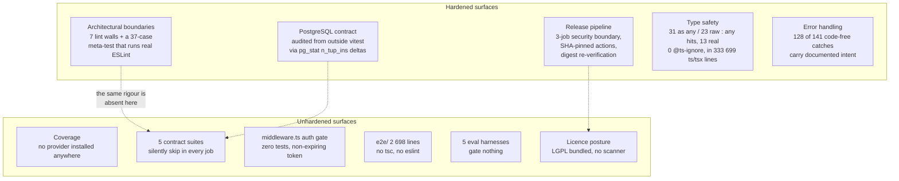

# 06b — Quality observations

Every claim here rests on a measurement in `06-quality-and-metrics.md` or a
citation in `01a`/`01b`/`05`. Read that file first for the numbers.

## Where the strength is, and where it isn't

The pattern is consistent and worth stating plainly: **whatever this team has
been burned by is hardened to an unusual degree, and whatever they have not been
burned by has no gate at all.** Every hardened surface carries the incident that
produced it in a comment. Every unhardened surface is silent.

## Genuine strengths

1. **Architectural boundaries are machine-enforced, and the enforcement is itself
   tested.** `eslint.config.mjs` encodes seven module walls as
   `no-restricted-syntax` / `no-restricted-imports` allowlists — three
   `@openmaic` package boundaries, three depth-specific `lib/video-export`
   scopes, `lib/choreography`, and the PBL v2 kernel — and
   `tests/lint-llm-entry-guard.test.ts` runs the *real* ESLint against the real
   config over a 5 bypass-form × 6 extension × 13 path matrix. Most repositories
   express these boundaries in a README and hope.
2. **The PostgreSQL contract audit asks the database, not the tests.**
   `scripts/assert-pg-contract-suites.mjs` phase 2 reads `n_tup_ins` deltas from
   outside the Vitest process against a pre-run baseline, precisely because
   everything inside `test/` is an ignored publishable input and therefore
   editable with no version bump. The docstring (lines 4-40) enumerates how each
   weaker version of the check could be defeated in one line, and the closing
   message (lines 314-318) states what it still does not prove.
3. **The release pipeline's security boundary is a job boundary, not a policy.**
   Install/build/pack run in a job with `contents: read` and no token
   (`publish-packages.yml:78-81`); the token-bearing job downloads an immutable
   artefact, re-verifies SHA-256 against a digest anchored in a parent shell
   scalar (`:372`), requires the commit to be on `main`'s first-parent history
   (`:284-296`), polls the Actions API for a green `ci.yml` on the same SHA
   (`:301-331`), and publishes with `--ignore-scripts`. `mark` is the only job
   with a git credential and it installs nothing.
4. **Type safety is exceptional at this scale.** 31 `as any`, 23 explicit
   `: any`, zero `@ts-ignore` in shipping code, `strict: true` across 333 699
   lines. All 31 `@ts-expect-error` are in tests, several as deliberate
   *negative* type assertions — and `ci.yml:181-184` adds a second `tsc` run over
   storage's test tree because "a probe nothing type-checks proves nothing".
5. **Error handling is documented rather than swallowed.** 128 of 141 code-free
   catch bodies carry an explanatory comment. The 13 that do not are all in
   null-origin browser storage shims where a `SecurityError` is the expected
   path, and `lib/utils/iframe.ts:3-13` writes out why.
6. **Every CI oddity carries its incident.** Sequential test steps
   (`ci.yml:133-135`), skipping `playwright install-deps` (`:251-254`),
   `grep -cx` over `grep -qx` (`publish-packages.yml:288-291`),
   `--no-replace-objects` (`ci.yml:101-106`), conditional
   `cancel-in-progress` (`:26`) — each names the failure it prevents rather than
   asserting a best practice.
7. **Zero `.only`, 7 skip markers, 9 TODOs, 5 `console.log`** across all 837 test
   files repo-wide (666 root `tests/` + 140 package + 16 `render-service` + 15
   Playwright specs) and the 333 699-line `.ts`/`.tsx` source set.
8. **One shared package registry.** `scripts/openmaic-packages.mjs` replaced four
   duplicated lists and cross-checks itself against both the filesystem and the
   release workflow's own hardcoded enumerations, in both directions, as sets.
9. **Contract suites for infrastructure the app cannot fake.** Eleven
   `*.pg.test.ts` and one `.s3.test.ts` exist at all, plus a Node-consumer smoke
   test that proves `@openmaic/generation` works outside Next.js
   (`ci.yml:151-178`) and a tarball smoke test that installs the exact bytes that
   would be published.
10. **The eval harnesses are honest about their own measurement.**
    `eval/orchestration/judge.ts:1-8` argues *against* using an LLM judge where
    the verdict is derivable from production parsing code, and `:30-34` excludes
    errored samples from the END-rate denominator, naming the incident (an
    Anthropic `Forbidden` reading as 100 % END).

## Real problems

Ordered roughly by consequence.

1. **No coverage instrumentation at all.** Nine Vitest configs, zero coverage
   providers, zero thresholds, zero upload steps. 7 837 statically-counted cases
   with no way to answer "what is untested". Largest single gap in the subsystem.
2. **Five contract suites never execute in CI.** Four app-level `*.pg.test.ts`
   (`tests/agent-runtime/event-notify.pg.test.ts:57`,
   `park-attempt-budget.pg.test.ts:30`, `session-events-live.pg.test.ts:51`,
   `tests/persistence/owner-materials.pg.test.ts:29`) and one
   `.s3.test.ts` skip in every job. The PG-contract job's own docstring argues at
   length that a silently-skipping suite is worse than no suite — and then five of
   them silently skip.
3. **`middleware.ts` — an authentication boundary — has no test.** HMAC
   verification (`:18-44`) and the `/workbench` 404 gate (`:56-58`) are
   unverified, and the signed timestamp is never compared to now
   (`:22-43`), so a leaked `openmaic_access` cookie never expires. Two of the
   three `access-code` route handlers also have no test.
4. **Three of six storage PG suites are outside `REQUIRED_SUITES`**
   (`scripts/assert-pg-contract-suites.mjs:61-65`). The audit whose purpose is to
   prevent a silently-narrowed suite set covers half of them.
5. **The eval harnesses gate nothing.** Five harnesses, 103 scenarios, four with
   real exit-code contracts — and no workflow invokes any of them. No baseline is
   committed (`git ls-files 'eval/*/results/*'` → empty), so there is nothing to
   regress against even manually. `eval/whiteboard-layout` has no pass threshold
   at all.
6. **`CONTRIBUTING.md` is factually wrong about the release contract.** Line 132
   says "Four packages … are published to npm: `dsl`, `storage`, `renderer`, and
   `importer`". The real list is six (`scripts/openmaic-packages.mjs:34`),
   omitting `generation` and `editor` — exactly the two whose contributors would
   therefore not know a version bump is required, and whose omission produces the
   CI failure the same paragraph documents. Line 171 also describes `packages/`
   as containing only the two vendored forks.
7. **`CONTRIBUTING.md`'s pre-PR checklist omits `pnpm test`.** Lines 76-85 list
   format, lint and `tsc` only, while `ci.yml` runs six separate test
   invocations. A contributor following the document exactly discovers test
   failures in CI.
8. **`e2e/` is neither type-checked nor linted.** Excluded from
   `tsconfig.json:39` and `eslint.config.mjs:53`, with no `e2e/tsconfig.json` and
   no `tsc` step anywhere. 2 698 lines of TypeScript whose only static checking is
   whatever Playwright's transpiler notices.
9. **LGPL in an MIT distribution.** `packages/mathml2omml` is
   LGPL-3.0-or-later and is bundled into the app via
   `lib/export/latex-to-omml.ts`. No licence-scanning step exists in any
   workflow, no `NOTICE` file, no third-party manifest — so a future copyleft
   addition would go unnoticed too.
10. **`@openmaic/editor` publishes with no `license` field** in its
    `package.json`, despite listing a `LICENSE` file in `files`. It is in the
    publish list, so it reaches npm with no SPDX identifier.
11. **`packages/pptxgenjs` has no `LICENSE` file** while declaring MIT in its
    manifest — the upstream licence text is not carried with the fork.
12. **`NEXT_PUBLIC_PRO_WORKBENCH_ENABLED` is missing from the Docker build args.**
    Ten of eleven public flags are plumbed through `Dockerfile:54-72` and
    `docker-compose.yml:14-21`; this one is not. Because it is inlined by
    `next build`, the container path cannot enable the Pro workbench at all.
13. **`vitest.eval.config.ts` is dead configuration** — zero matching files, zero
    references in any script, workflow or document. Delete it or give it files.
14. **`lib/action/engine.ts` is the type-safety hotspot.** Nine `as any` and nine
    `eslint-disable @typescript-eslint/no-explicit-any` on the same nine lines, in
    the module that executes every classroom action. It is simultaneously the top
    offender on both metrics.
15. **Eight React components exceed 1 400 lines**, and they are the same files
    carrying most of the 34 `react-hooks/set-state-in-effect` suppressions:
    `WorkspaceRail.tsx` (2 298), `use-chat-sessions.ts` (2 286),
    `roundtable/index.tsx` (2 189), `PlaybackChromeRoot.tsx` (1 848),
    `tts-settings.tsx` (1 672), `pbl/v2/chat.tsx` (1 553),
    `outlines-editor.tsx` (1 523), `ActionsBar.tsx` (1 480). 59 source files
    exceed 800 lines.
16. **Workflow YAML is not format-checked.** `.prettierignore` excludes `*.yml`
    and `*.yaml`, so 1 228 lines of workflow are outside `pnpm check`.
17. **Three of five workflows declare no `permissions` block** and use floating
    action tags. `ci.yml`, `storage-pg-contract.yml` and `docs-build.yml` inherit
    the repository default token scope and pin actions only to `@v4`, unlike the
    two publish workflows which SHA-pin everything and declare least-privilege
    per job. `ci.yml` and `storage-pg-contract.yml` also omit
    `persist-credentials: false`.
18. **Seven unused manifest entries** — `@copilotkit/backend`,
    `@copilotkit/runtime`, `copilotkit`, `@modelcontextprotocol/sdk`,
    `@ai-sdk/react`, `@alicloud/credentials`, `vue-to-react`. Install time, image
    size and vulnerability-audit surface with no consumer.
19. **`render-service` pins published `@openmaic/dsl@0.11.0` and
    `@openmaic/renderer@0.1.4`** while the workspace is at `0.11.1` / `0.1.6`.
    Nothing in CI compares them, so the service that renders the app's documents
    can silently drift behind the schema it renders.
20. **`components/ai-elements/web-preview.tsx:159`** carries
    `sandbox="allow-scripts allow-same-origin allow-forms allow-popups allow-presentation"`
    and is imported nowhere. It renders `src=` rather than `srcDoc`, so
    `tests/security/iframe-sandbox.test.ts`'s stated threat model may not apply —
    but the file is unreachable dead code with a permissive sandbox, which is a
    poor pattern to leave in a tree where three other files are actively guarded
    against exactly that token combination.

## Suggested first three fixes

If only three things get done, these have the best ratio of effort to risk
removed:

| Fix | Effort | Removes |
| --- | --- | --- |
| Correct `CONTRIBUTING.md:132` to six packages and add `pnpm test` to the pre-PR list | minutes | The most likely first-contributor CI failure, on a gate the document itself explains |
| Add `PG_CONTRACT_URL` to a step that runs the four app-level `*.pg.test.ts`, and give them the `STORAGE_PG_CONTRACT_REQUIRED` hard-fail guard the whiteboard suite already has | ~20 lines of YAML | Four silently-skipping suites over NOTIFY delivery, attempt-budget fencing, SSE tails and quota locking |
| Install `@vitest/coverage-v8` and report (do not gate) coverage on the root project | one dependency + one config block | The inability to answer any coverage question at all |

Deliberately *not* on this list: adding the eval harnesses to CI. They spend real
provider tokens and have no committed baseline, so wiring them up before a
baseline exists would produce a flaky gate rather than a signal.
