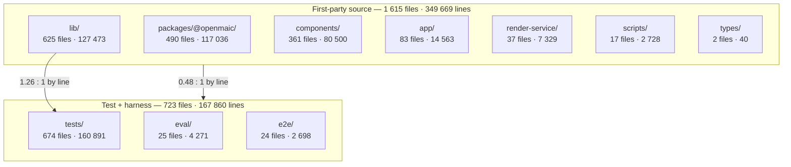
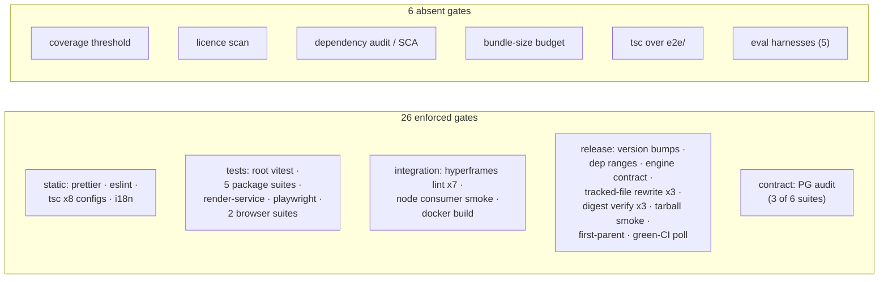

# 06c — Measured metrics: scale, module size, dependency counts, gate inventory

Continues `06-quality-and-metrics.md`. Same caveat applies: `node_modules` absent,
so every figure is static.

## Where the mass is



```bash
for d in app components lib packages/@openmaic tests e2e eval render-service scripts types; do
  find $d -type f \( -name '*.ts' -o -name '*.tsx' -o -name '*.mjs' -o -name '*.js' \) \
    ! -path '*/node_modules/*' ! -path '*/dist/*' | wc -l
  find $d -type f \( -name '*.ts' -o -name '*.tsx' -o -name '*.mjs' -o -name '*.js' \) \
    ! -path '*/node_modules/*' ! -path '*/dist/*' -print0 | xargs -0 cat | wc -l
done
```

| Tree | Files | Lines |
| --- | --- | --- |
| `lib` | 625 | 127 473 |
| `packages/@openmaic` | 490 | 117 036 |
| `components` | 361 | 80 500 |
| `app` | 83 | 14 563 |
| `render-service` | 37 | 7 329 |
| `scripts` | 17 | 2 728 |
| `types` | 2 | 40 |
| **first-party source subtotal** | **1 615** | **349 669** |
| `tests` | 674 | 160 891 |
| `eval` | 25 | 4 271 |
| `e2e` | 24 | 2 698 |

Test-to-source ratio by line count: **0.48 : 1** overall; **1.26 : 1** against
`lib/` alone. (`packages/@openmaic` figures include each package's own `test/`
tree, which is why the two ratios differ.)

## File-size distribution

```bash
find app components lib packages/@openmaic/*/src render-service/src types \
  -type f \( -name '*.ts' -o -name '*.tsx' \) ! -path '*/dist/*' -print0 \
  | xargs -0 wc -l | grep -v ' total$' \
  | awk '{n=$1; if(n<=100)a++; else if(n<=200)b++; else if(n<=400)c++;
          else if(n<=800)d++; else if(n<=1500)e++; else f++}
         END {print a,b,c,d,e,f,a+b+c+d+e+f}'
```

| Bucket | Files | Share |
| --- | --- | --- |
| ≤ 100 lines | 646 | 46.7 % |
| 101-200 | 311 | 22.5 % |
| 201-400 | 241 | 17.4 % |
| 401-800 | 125 | 9.0 % |
| 801-1 500 | 41 | 3.0 % |
| > 1 500 | 18 | 1.3 % |
| **Total** | **1 382** | |

```bash
find app components lib packages/@openmaic/*/src render-service/src \
  -type f \( -name '*.ts' -o -name '*.tsx' \) ! -path '*/dist/*' -print0 \
  | xargs -0 wc -l | grep -v total | awk '$1>800' | wc -l    # 59
```

**59 source files exceed 800 lines — 4.3 % of the tree.** 86.6 % sit at 400 lines
or below, so the distribution is healthy in the aggregate and concentrated in a
small, identifiable tail.

## Top 25 largest first-party modules

```bash
find app components lib packages/@openmaic render-service/src types -type f \
  \( -name '*.ts' -o -name '*.tsx' \) ! -path '*/node_modules/*' ! -path '*/dist/*' \
  -print0 | xargs -0 wc -l | sort -rn | head -26
```

| # | Lines | Path | Kind |
| --- | --- | --- | --- |
| 1 | 6 574 | `packages/@openmaic/importer/src/shapes/presets.ts` | data table |
| 2 | 2 420 | `lib/ai/providers.ts` | provider adapters |
| 3 | 2 298 | `components/workbench/workspace/WorkspaceRail.tsx` | React |
| 4 | 2 286 | `components/chat/use-chat-sessions.ts` | React hook |
| 5 | 2 248 | `lib/store/settings.ts` | zustand store |
| 6 | 2 189 | `components/roundtable/index.tsx` | React |
| 7 | 2 173 | `lib/workbench/session-store.ts` | zustand store |
| 8 | 1 931 | `packages/@openmaic/generation/src/scene-generator.ts` | generator |
| 9 | 1 923 | `lib/server/agent-runtime/runner.ts` | server runtime |
| 10 | 1 896 | `app/page.tsx` | React page |
| 11 | 1 864 | `lib/pbl/v2/agents/instructor.ts` | agent |
| 12 | 1 848 | `components/edit/PlaybackChromeRoot.tsx` | React |
| 13 | 1 838 | `packages/@openmaic/editor/test/react/EditableSlideCanvas.test.tsx` | **test** |
| 14 | 1 794 | `packages/@openmaic/importer/src/serializer/textSerializer.ts` | serializer |
| 15 | 1 710 | `packages/@openmaic/storage/src/agent-session/pg.ts` | PG backend |
| 16 | 1 672 | `components/settings/tts-settings.tsx` | React |
| 17 | 1 554 | `app/generation-preview/page.tsx` | React page |
| 18 | 1 553 | `components/scene-renderers/pbl/v2/chat.tsx` | React |
| 19 | 1 523 | `components/generation/outlines-editor.tsx` | React |
| 20 | 1 485 | `packages/@openmaic/storage/test/http-asset-store.test.ts` | **test** |
| 21 | 1 480 | `components/edit/ActionsBar/ActionsBar.tsx` | React |
| 22 | 1 455 | `lib/utils/chat-storage.ts` | storage util |
| 23 | 1 454 | `lib/audio/constants.ts` | data table |
| 24 | 1 443 | `lib/export/use-export-pptx.ts` | React hook |
| 25 | 1 404 | `lib/video-export/emit-hyperframes/index.ts` | emitter |

Entries 1 and 23 are data tables and are defensible at that size. Entries 13 and
20 are test files. The remaining 21 are production modules, and **eight of them
are React components over 1 400 lines** (3, 6, 12, 16, 18, 19, 21, plus the two
page components 10 and 17) — the same files that carry most of the 34
`react-hooks/set-state-in-effect` suppressions. That correlation is the clearest
structural signal in the survey: the largest components are also the ones opting
out of React's effect rules.

## Dependency and lockfile metrics

```bash
node -e "const p=require('./package.json');
  console.log(Object.keys(p.dependencies).length, Object.keys(p.devDependencies).length)"
grep -c 'resolution:' pnpm-lock.yaml    # 2723
ls -la pnpm-lock.yaml                   # ~935 KB
find . -name 'pnpm-lock.yaml' -o -name 'package-lock.json' | grep -v node_modules
```

| Metric | Value |
| --- | --- |
| root `dependencies` | 132 |
| root `devDependencies` | 32 |
| caret / exact / workspace (dependencies) | 111 / 13 / 8 |
| caret / exact (devDependencies) | 25 / 7 |
| lockfile `resolution:` entries | 2 723 |
| lockfile size | ~935 KB |
| `lockfileVersion` | `'9.0'` |
| manifest entries with no reference in first-party source | 7 |
| independent lockfiles in the repo | 3 (root pnpm, `render-service` npm, `packages/docs` pnpm) |
| published `@openmaic` packages | 6 (`dsl` 0.11.1, `generation` 0.3.5, `storage` 0.28.1, `renderer` 0.1.6, `editor` 0.0.5, `importer` 0.1.3) |
| vendored forks | 2 (`pptxgenjs` 4.0.1 MIT, `mathml2omml` 0.5.0 LGPL-3.0-or-later) |

## Gate inventory



| Gate | Enforced where | Blocking? |
| --- | --- | --- |
| Prettier `--check` | `ci.yml:128` via `ci-run-parallel.sh` | yes (excludes `*.md`, `*.yml`, `*.yaml`) |
| ESLint (10 blocks, 7 boundary walls) | `ci.yml:129` | yes |
| `tsc --noEmit` (root config, includes `tests/` + `eval/`) | `ci.yml:130` | yes |
| `tsc` for generation (× 2 configs), storage (× 2), renderer, editor, dsl | `ci.yml:146,184` + `publish-packages.yml:223-225` | yes |
| `tsc` for `render-service` | `ci.yml:216` | yes |
| `tsc` for `e2e/` | **nowhere** | no |
| i18n leaf-key parity | `ci.yml:131` | yes |
| Root Vitest (666 files — the root `tests/` suite only) | `ci.yml:137` | yes |
| Package Vitest × 5 | `ci.yml:140,143,149,187` + release job | yes |
| `render-service` Vitest | `ci.yml:220` | yes |
| Playwright (15 specs) | `ci.yml:333` | yes |
| Two browser Vitest suites | `ci.yml:272,277` | yes |
| Hyperframes lint × 7 samples | `ci.yml:289-311` | yes |
| Node consumer smoke (generation) | `ci.yml:151-178` | yes |
| Docker build of `render-service` | `ci.yml:223` | yes |
| Parallel-runner self-test | `ci.yml:41-50` | yes |
| Package version bumps | `ci.yml:61,79` + `publish-packages.yml:115,375` | yes |
| Internal dependency ranges | `ci.yml:89` | yes |
| Node engine contract | `ci.yml:94` | yes |
| Tracked-file-rewrite check | `ci.yml:107-121`, `publish-packages.yml:143-157,338-350` | yes |
| PostgreSQL contract audit (3 of 6 suites) | `storage-pg-contract.yml:53-64` + release job | yes |
| Tarball digest verification (× 3) | `publish-packages.yml:179,184,274,373` | yes |
| Tarball install smoke test | `publish-packages.yml:237` | yes |
| First-parent-history check | `publish-packages.yml:284-296` | yes |
| Green-`ci.yml`-for-this-SHA poll | `publish-packages.yml:301-331` | yes |
| Docs site build | `docs-build.yml:36` (path-filtered) | yes |
| ClawHub bash 3.2 compatibility | `publish-openmaic-skill.yml:56-112` | yes (PR only) |
| Coverage threshold | **nowhere** | no |
| Licence scan | **nowhere** | no |
| Dependency audit / SCA | **nowhere** | no |
| Bundle-size budget | **nowhere** | no |
| Eval harnesses (5) | **nowhere** | no |

**27 enforced gates, 6 absent.** Note also that `assert-vendor-maic-importer.mjs`
runs inside `pnpm build` rather than as its own step, so it gates the `e2e` job's
build and any Vercel/Docker build, but does not appear as a named check.

Observations drawn from this table, ranked by consequence, are in
`06b-quality-observations.md`.
