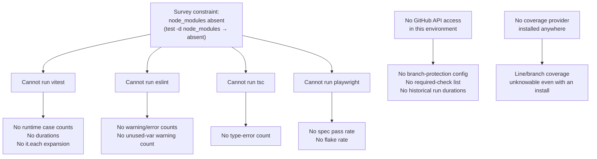

# 07 — Open questions

Everything here is something I could not determine from the checkout, with the
reason. No guesses.

## Why some questions are unanswerable from this checkout

## Runtime facts not measurable statically

| Question | Why not answered |
| --- | --- |
| Actual executed test-case count | `it.each`/`test.each` appears 272 times (`grep -rhoE '\b(it\|test)\.each\b' tests packages/@openmaic/*/test \| wc -l`); each expands to N runtime cases determined by its table. The static 7 837 is a lower bound. |
| Wall-clock duration of each CI job | `ci.yml` declares `timeout-minutes` 15/10/15 but no run history is reachable from this environment. The only recorded figure is a comment: the four linters were "~2 minutes" sequential ([`ci.yml:123-124`](.github/workflows/ci.yml#L123-L124)). |
| Whether the suite currently passes | Not run. `node_modules` absent, and installing would execute the 9-step `postinstall` chain against the network. |
| Current ESLint warning count | `@typescript-eslint/no-unused-vars` is configured as `'warn'` ([`eslint.config.mjs:65`](eslint.config.mjs#L65)), so the repository may carry warnings that no gate counts. Unmeasurable without running ESLint. |
| Real flake rate of the e2e specs | `retries: 2` in CI implies flakes are expected, but the rate is only visible in run history. |

## Branch protection and required checks

**Not determinable from the repository.** The critical question is which check
names are *required* to merge. Three pieces of evidence show the design intends
specific answers, but none of them is the setting itself:

- [`publish-openmaic-skill.yml:8-9`](.github/workflows/publish-openmaic-skill.yml#L8-L9) says "Do not configure it as a required check
  for every PR; require it only through rules that apply to the paths below."
- [`publish-packages.yml:29-36`](.github/workflows/publish-packages.yml#L29-L36) documents required repository setup: an npm org, a
  `release` GitHub Environment restricted to `main`, and `NPM_TOKEN` present as
  an *environment* secret and absent as a *repository* secret.
- [`publish-packages.yml:298-300`](.github/workflows/publish-packages.yml#L298-L300) states that `ci.yml` "runs concurrently with this
  workflow on a push to main and blocks nothing", which is why the publish job
  polls the API instead of relying on a gate.

Unanswered: is `Lint, Typecheck & Unit Tests` a required check? Is
`Storage Contract (PostgreSQL 16)`? Is `E2E Tests`? Is `Render Service`? Is the
`release` environment's branch rule actually configured? Is `NPM_TOKEN` in fact
absent as a repository secret? Every one of those is a GitHub settings question.

## Coverage

**Unknowable.** No coverage provider is installed
(`grep -rn 'coverage' package.json packages/@openmaic/*/package.json render-service/package.json vitest*.config.ts …`
returns nothing), so line/branch coverage cannot be produced even after an
install without first adding a dependency. The reference heuristic in
[`06-quality-and-metrics.md`](docs/appendix/research/quality-testing-ci-deps/06-quality-and-metrics.md) is a proxy for *mention*, not execution, and I could
not close the gap between them.

Specifically unresolved:

- Is `lib/api` (3/9 modules mentioned) genuinely under-tested, or is it exercised
  transitively through the route handler tests that dominate `tests/api`?
- Is `components/ai-elements` (3/30) intentionally untested vendored UI, or drift?
  It contains `web-preview.tsx`, which is imported nowhere
  (`grep -rln 'web-preview' app components lib` → no hits) and carries a
  `sandbox="allow-scripts allow-same-origin allow-forms allow-popups allow-presentation"`
  attribute ([`components/ai-elements/web-preview.tsx:159`](components/ai-elements/web-preview.tsx#L159)) that
  `tests/security/iframe-sandbox.test.ts` does not check. It renders `src=` rather
  than `srcDoc`, so the test's stated threat model may not apply — but whether the
  file is dead code slated for deletion or a component awaiting wiring is not
  recorded anywhere.

## Deliberate versus accidental

Six things look like defects but could be intentional. Nothing in the repository
records a decision either way.

1. **`vitest.eval.config.ts`** — zero matching files, zero references. Is it a
   leftover from a removed `*.eval.test.ts` convention, or scaffolding for one
   that is planned? No CHANGELOG entry, no comment.
2. **Four app-level `*.pg.test.ts` never running in CI.** The PG job explicitly
   invokes `tests/lib/whiteboard/runtime-store.pg.test.ts` and only that one
   ([`storage-pg-contract.yml:66-67`](.github/workflows/storage-pg-contract.yml#L66-L67)). Are the other four expected to be added, or
   considered redundant with the storage-package suites?
3. **Three storage PG suites outside `REQUIRED_SUITES`.** The list comment
   ([`scripts/assert-pg-contract-suites.mjs:67-72`](scripts/assert-pg-contract-suites.mjs#L67-L72)) explains why
   `REQUIRED_TABLES` is stated independently, but says nothing about why the
   agent-session and asset suites are excluded from `REQUIRED_SUITES`.
4. **The `.s3.test.ts` suite with no CI service.** Was a MinIO service planned?
   `docker-compose.yml` has no S3-compatible service either.
5. **`NEXT_PUBLIC_PRO_WORKBENCH_ENABLED` absent from the Docker build args.** Is
   the Pro workbench deliberately not shipped in the container image, or is this
   an omission? [`.env.example:310-313`](.env.example#L310-L313) documents the variable for operators
   without saying which deployment paths support it.
6. **Seven unused manifest entries** (three `copilotkit` packages,
   `@modelcontextprotocol/sdk`, `@ai-sdk/react`, `@alicloud/credentials`,
   `vue-to-react`). Are any of them pinned to satisfy a transitive peer that my
   scan missed, or planned for imminent use? I verified only that no first-party
   file contains their specifier and that they are not declared as peers by
   anything in `pnpm-lock.yaml`'s importer section — I did not audit every
   transitive `peerDependencies` block.

## Licence questions that need a human

- **`packages/mathml2omml` is LGPL-3.0-or-later** and is imported by
  `lib/export/latex-to-omml.ts`, i.e. bundled into an MIT-licensed distributed
  application. Whether LGPL §4's relinking provisions are satisfied by shipping a
  Next.js bundle is a legal question. There is no `NOTICE`, no third-party-licence
  manifest, and no licence-scanning CI step, so I cannot tell whether this was
  reviewed.
- **`packages/pptxgenjs` declares MIT in `package.json` but has no `LICENSE`
  file** in the package directory. The upstream project's licence text is
  therefore not carried with the fork.
- **`@openmaic/editor` has no `license` field** in its manifest while shipping a
  `LICENSE` file. Is the omission intentional (e.g. a pending licence decision)
  or a typo? The package is in the publish list, so it goes to npm with no SPDX
  identifier.

## Security questions I could not resolve

- **`middleware.ts` token expiry.** `verifyToken` ([`middleware.ts:18-44`](middleware.ts#L18-L44)) signs
  and verifies a `<timestamp>.<hmac>` pair but never compares the timestamp to
  now. Is a non-expiring access cookie the intended behaviour for an access-code
  gate (i.e. the code itself is the rotation mechanism), or an oversight? No test
  and no comment addresses it.
- **Whether `validateUrlForSSRF`'s validate-then-fetch shape matters in
  practice.** 15 of its 20 call sites pass an operator-configured
  `clientBaseUrl`, where DNS rebinding is not a meaningful threat. Two —
  `app/api/proxy-media/route.ts:33,55` and
  [`app/api/provider/probe-models/route.ts:34`](app/api/provider/probe-models/route.ts#L34) — take less-trusted input. Whether
  those two should migrate to the pinned-lookup path used by
  [`lib/server/agent-runtime/fetch-url.ts:165-174`](lib/server/agent-runtime/fetch-url.ts#L165-L174) is a design decision I found no
  record of.
- **Repository-default `GITHUB_TOKEN` permissions.** `ci.yml`,
  `storage-pg-contract.yml` and `docs-build.yml` declare no `permissions:` block,
  so their token scope is whatever the repository default is. That default is a
  settings value, not a file.
- **[`SECURITY.md`](SECURITY.md) process completeness.** It commits to a 48-hour acknowledgement
  and GitHub Private Vulnerability Reporting (`SECURITY.md:20,29`) but names no
  fix-time SLA, no severity taxonomy, and no supported-version window beyond
  "latest major release and the active `main` branch". Whether a longer policy
  exists elsewhere (a handbook, the Discord) I cannot see from here.

## Eval harness questions

- **Why do the evals gate nothing?** Four of the five have real exit-code
  contracts ([`eval/orchestration/runner.ts:187`](eval/orchestration/runner.ts#L187),
  [`eval/outline-language/runner.ts:168`](eval/outline-language/runner.ts#L168),
  [`eval/pbl-v2-planner/runner.ts:919`](eval/pbl-v2-planner/runner.ts#L919), plus the two answering runners), yet no
  workflow invokes them. Cost is the obvious hypothesis — every run spends real
  provider tokens, `eval/outline-language` has 50 cases and
  `eval/pbl-v2-planner` 23 × up to 2 variants with two judges each — but no
  comment or document states it.
- **Why does `eval/whiteboard-layout` have no threshold?** Its four siblings all
  do. It also requires a live app on `--base-url` and a headed capture browser,
  so it may simply be classified as exploratory. Not recorded.
- **Are there baseline scores anywhere?** No. `git ls-files 'eval/*/results/*'`
  returns nothing, so no historical run is tracked and every eval starts from
  zero. There is no committed baseline to regress against, which is the deeper
  reason the harnesses cannot gate: a threshold on an absolute score is a much
  weaker signal than a delta against a recorded run.

  A related loose end: [`.gitignore:75-80`](.gitignore#L75-L80) ignores results for
  `whiteboard-layout`, `outline-language` and the three `orchestration` output
  directories, but **not** `eval/pbl-v2-planner/results/`. A PBL run therefore
  leaves untracked files that appear in `git status` and can be committed by
  accident. Whether that omission is deliberate (the compare-HTML page might be
  meant to be shareable) is not recorded.
- **`eval/pbl-v2-planner/serve.ts` and `build-compare.ts`** build a local
  side-by-side HTML compare page. Whether that page is part of a documented
  review ritual or a one-off debugging aid is not stated.

## Metrics I chose not to claim

- **A repository-wide `any` count.** `grep -owE '\bany\b'` over the source trees
  returns 697, but that includes the English word "any" in comments and prose. I
  report only the two forms I could isolate reliably: `as any` (31) and `: any`
  (23 raw regex hits over `app`, `components`, `lib`, `packages/@openmaic`,
  `render-service/src`, `types`, `dist` excluded — package `test/` trees
  included). The `: any` figure carries the same prose contamination at smaller
  scale: 10 of the 23 are the English word "any" after a colon in a doc comment,
  so **13** are real annotations. A precise total would need a TypeScript AST
  pass, which needs an install.
- **Non-null assertion count as anything but a heuristic.** The 307 figure comes
  from a regex (`[A-Za-z0-9_)\]]\!(\.|\)|,|;|\[| )` minus `!=` hits). It will
  miss some forms and may catch a few template-literal or string-content false
  positives. Treat it as an order of magnitude, not a count.
- **Cyclomatic complexity, duplication, or dependency-cycle counts.** No tool for
  any of these is installed (no `knip`, no `dependency-cruiser`, no
  `jscpd`, no `madge`), and running one would mean adding a dependency.
- **Whether `tests/` line count is a meaningful quality signal.** 160 230 test
  lines against 349 669 source lines is reported as a ratio because it is
  measurable, not because I am claiming it predicts anything.

## Documentation drift I found but could not date

[`CONTRIBUTING.md:139`](CONTRIBUTING.md#changing-a-published-package) names four published packages where the code has six, and
[`CONTRIBUTING.md:178`](CONTRIBUTING.md#project-structure) describes `packages/` as containing only the two vendored
forks. [`CHANGELOG.md`](CHANGELOG.md) shows nine releases with `1.0.0` on 2026-08-27, and the
`generation`/`editor` packages are at `0.3.5`/`0.0.5`, so both were likely added
after [`CONTRIBUTING.md`](CONTRIBUTING.md) was last revised. I did not run `git log` on
[`CONTRIBUTING.md`](CONTRIBUTING.md) to establish when the drift opened, so the exact commit that
should have updated it is unidentified.
