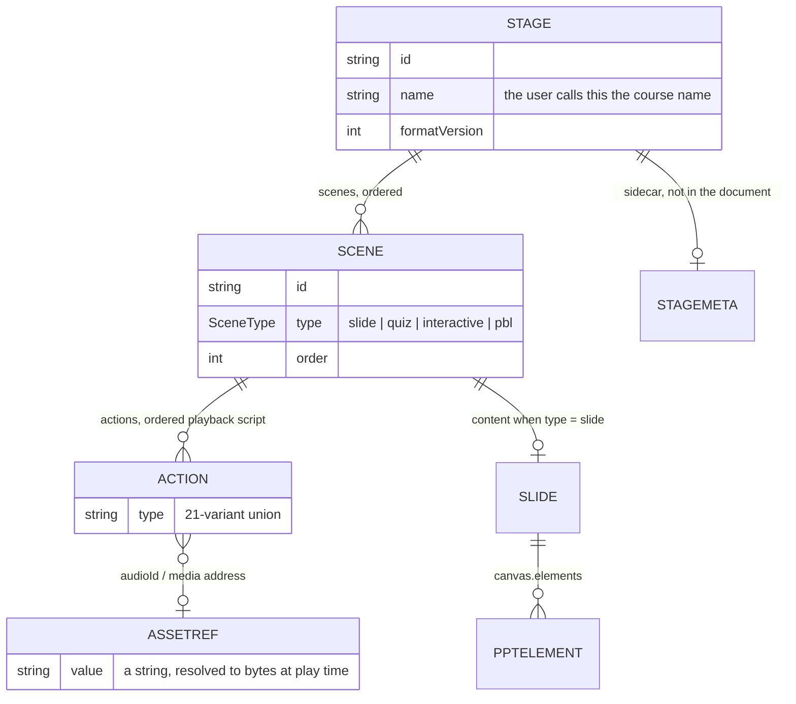
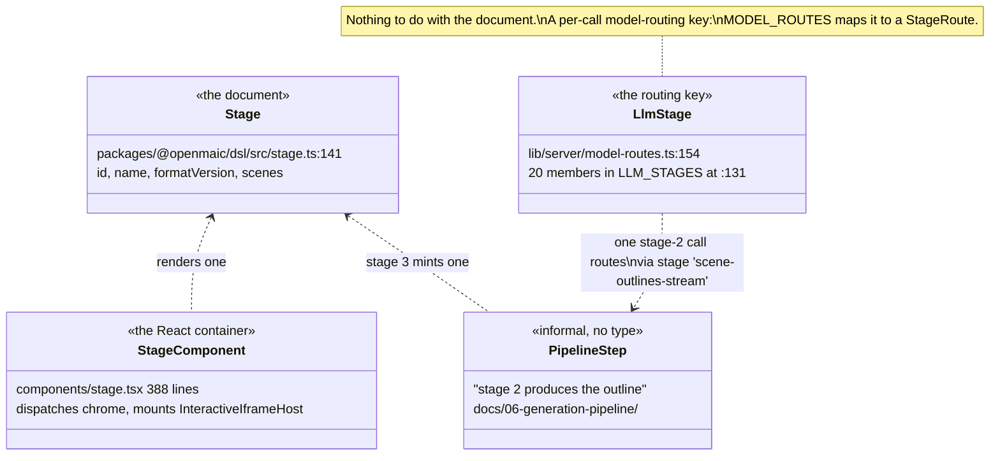
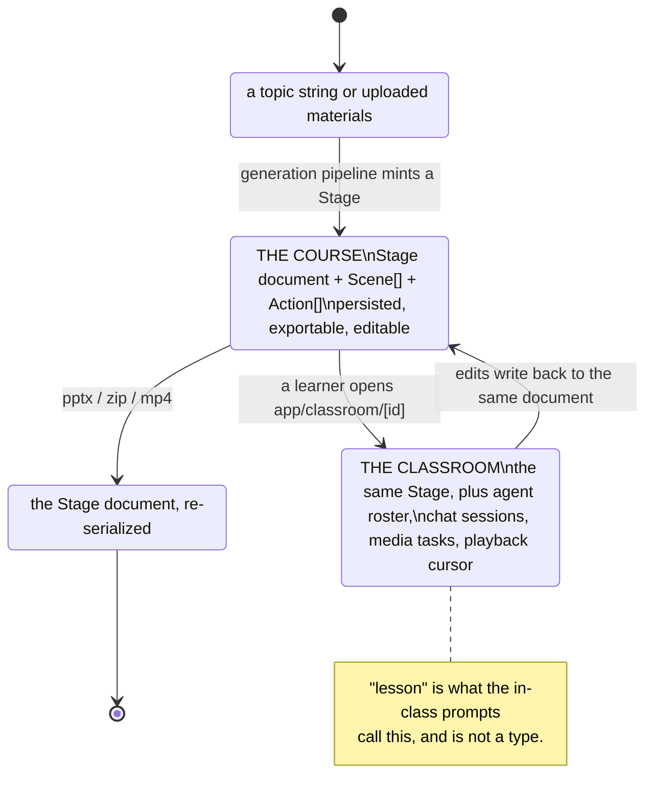

# Glossary

One canonical definition per term for the whole set. Where a word is overloaded in the
codebase, every sense is listed with the type or file that owns it — because the fastest
way to misread this system is to assume a word means the same thing in two topics.

Frequencies below are word counts over the seventeen topic directories plus
`README.md`, measured with
`grep -rioh "\b<word>" --include='*.md' <topic dirs> README.md | wc -l`. They are here to
show which words carry the most weight, not as a quality signal.

Two topics used to define this vocabulary locally and slightly differently. They now link
here instead: [`06-generation-pipeline/index.md`](docs/06-generation-pipeline/index.md)
§Vocabulary keeps only the terms specific to the pipeline, and
[`08-classroom-runtime/01-playback-vocabulary.md`](docs/08-classroom-runtime/01-playback-vocabulary.md)
keeps only the playback-engine internals.

## The document spine

| Term | Canonical meaning | Owned by |
| --- | --- | --- |
| **Stage** (the document) | the persisted course document: an id, a name, a `formatVersion`, and an ordered list of scenes. **This is the unit of persistence.** | [`packages/@openmaic/dsl/src/stage.ts:141`](packages/@openmaic/dsl/src/stage.ts#L141) |
| **Scene** | one screen of a course, carrying a `type` discriminant and its own ordered `Action[]` | `SceneCore` at [`packages/@openmaic/dsl/src/stage.ts:228`](packages/@openmaic/dsl/src/stage.ts#L228), `Scene` at [`:278`](packages/@openmaic/dsl/src/stage.ts#L278) |
| **SceneType** | `'slide' \| 'quiz' \| 'interactive' \| 'pbl'` — exactly four, with a frozen `SCENE_TYPES` tuple beside it | [`packages/@openmaic/dsl/src/stage.ts:22,25`](packages/@openmaic/dsl/src/stage.ts#L22) |
| **Action** | one playback verb. A 21-variant discriminated union — speak, draw, reveal, wait, and so on | [`packages/@openmaic/dsl/src/action.ts:235`](packages/@openmaic/dsl/src/action.ts#L235) |
| **Slide** | the content payload of a `type: 'slide'` scene: a canvas plus its elements | [`packages/@openmaic/dsl/src/slides.ts:953`](packages/@openmaic/dsl/src/slides.ts#L953) |
| **PPTElement** | one addressable thing on a slide canvas (text, image, shape, line, chart, code, table, latex, video) | `packages/@openmaic/dsl` |
| **AssetRef** | `type AssetRef = string` — an *address*, never bytes. Resolved to bytes at play, export or render time by whichever backend the deployment uses | [`packages/@openmaic/dsl/src/storage.ts:41`](packages/@openmaic/dsl/src/storage.ts#L41) |
| **stage-meta** | a sidecar record keyed by stage id, holding what does not belong in the serialized document | [`10-persistence-and-state/02-data-model.md`](docs/10-persistence-and-state/02-data-model.md) |

## Stage has four senses. This is the one to get right.

`stage` appears **1 228 times** in this set, and four distinct things answer to it.
Nothing in the code disambiguates them; only the surrounding type does.

| Sense | What it is | Where |
| --- | --- | --- |
| **Stage-the-document** | the course document; the unit of persistence | [`packages/@openmaic/dsl/src/stage.ts:141`](packages/@openmaic/dsl/src/stage.ts#L141) |
| **`components/stage.tsx`** | the top-level React container that dispatches chrome and mounts `InteractiveIframeHost`. 388 lines | `components/stage.tsx` |
| **`LlmStage`** | one of the 20 routable *model-selection* keys — `'scene-outlines-stream'`, `'scene-content:quiz'`, `'maic-agent-driver'`, … Used by `MODEL_ROUTES` to pin a model per call site. Has no relationship to the document | `LLM_STAGES` at [`lib/server/model-routes.ts:131`](lib/server/model-routes.ts#L131), `LlmStage` at [`:154`](lib/server/model-routes.ts#L154); routing in [`04-ai-provider-layer/03-stage-routing.md`](docs/04-ai-provider-layer/03-stage-routing.md) |
| **stage-as-pipeline-step** | prose only, no type: "stage 2 produces the outline", "stage 4 generates scenes". Four steps | [`06-generation-pipeline/01-pipeline-overview.md`](docs/06-generation-pipeline/01-pipeline-overview.md) |

**Convention for this set:** write *the Stage document* or *`Stage`* for the first,
*`components/stage.tsx`* for the second, *`LlmStage`* or *routing stage* for the third, and
*pipeline step N* for the fourth. A bare "stage" means the document.

## Course, classroom, lesson

These three are the words a newcomer most often uses interchangeably, and only two of
them mean anything in the code.

| Term | Frequency in this set | What it actually is |
| --- | --- | --- |
| **course** | 270 | **The Stage document as a user-facing artefact.** There is no `Course` type. `CourseDocument` is an alias — `MaicDocument<Scene, Stage>` ([`lib/server/agent-runtime/course-tools.ts:57`](lib/server/agent-runtime/course-tools.ts#L57)) — and a reference to one is `CourseRef { kind: 'course'; stageId: string; title: string }` ([`lib/workbench/course-refs.ts:20-28`](lib/workbench/course-refs.ts#L20-L28)), where `title` is explicitly "display + degradation only: never the name the agent is told to trust". Renaming a course is `PATCH /api/stages/:id`, and the name "lands in the stage document" ([`lib/live/server-api.ts:22-30`](lib/live/server-api.ts#L22-L30)). So: **course = Stage, viewed by a person** |
| **classroom** | 846 | **A course being played, plus the live state around it.** The route is `app/classroom/[id]/page.tsx`; the load payload is `ClassroomPayload` ([`lib/classroom/load-classroom.ts:32`](lib/classroom/load-classroom.ts#L32)); the export bundle is `ClassroomManifest` ([`lib/export/classroom-zip-types.ts:14`](lib/export/classroom-zip-types.ts#L14)); generating one end to end is `ClassroomGenerationStep` ([`lib/server/classroom-generation.ts:62`](lib/server/classroom-generation.ts#L62)). The extra state a classroom has over a course: the agent roster, chat sessions, media tasks and playback position |
| **lesson** | 10 | **Not a domain concept.** It exists in the codebase only as prompt text and two `close_session.endReason` string literals — `back_to_lesson` and `lesson_complete` ([`lib/chat/pi/prompts.ts:115,119`](lib/chat/pi/prompts.ts#L115)). Avoided in this set's prose except when quoting those literals |

## Utterance has no type at all

`utterance` appears 28 times in this set and **zero** times as a type in the codebase. Two
structurally different things get called it, and a third granularity exists below both.

| What a reader means | Actual type | Audio source |
| --- | --- | --- |
| a pre-authored narration line | `SpeechAction` with an optional `audioId: AssetRef` ([`packages/@openmaic/dsl/src/action.ts:47`](packages/@openmaic/dsl/src/action.ts#L47)), inside `scene.actions` | pre-generated bytes resolved at play time by `AudioPlayer.play` ([`lib/utils/audio-player.ts:99`](lib/utils/audio-player.ts#L99)), falling back to browser TTS, then to a timer |
| a live agent's spoken segment | a `TextItem` in the `StreamBuffer` queue ([`lib/buffer/stream-buffer.ts:35`](lib/buffer/stream-buffer.ts#L35)), sealed then queued; in memory only | synthesised per segment by `useDiscussionTTS` after `onSegmentSealed` ([`lib/hooks/use-discussion-tts.ts:351`](lib/hooks/use-discussion-tts.ts#L351)) |
| one browser speech call | a real `SpeechSynthesisUtterance` — a `SpeechAction`'s text is split into sentence chunks because Chrome silently truncates past roughly fifteen seconds and never fires `onend` ([`lib/playback/engine.ts:757,798`](lib/playback/engine.ts#L757)) | browser TTS |

**Convention for this set:** *narration line* for the first, *live segment* for the
second, *chunk* for the third. The bare word *utterance* is not used.

## The remaining overloads

| Word | Sense A | Sense B |
| --- | --- | --- |
| **whiteboard** | a `Slide`-shaped document attached to a stage or a scene | the live overlay layer rendered at `z-[110]` above scene content ([`components/canvas/canvas-area.tsx:123-127`](components/canvas/canvas-area.tsx#L123-L127)) |
| **mode** | `StageMode` — `autonomous \| playback \| edit`, the chrome selector | `EngineMode` — `idle \| playing \| paused \| live`, the playback state ([`lib/playback/types.ts:18`](lib/playback/types.ts#L18)) |
| **cursor** | the engine's private `(sceneIndex, actionIndex)` pair ([`lib/playback/engine.ts:64-65`](lib/playback/engine.ts#L64-L65)) | `PlaybackCursor`, the persisted `{sceneId, actionIndex, updatedAt}` record in device KV (`lib/playback/cursor.ts`) |
| **generation** | the act of producing a course from a requirement | `playbackGeneration`, a monotonic counter that *is* the playback cancellation primitive ([`lib/playback/engine.ts:96,493`](lib/playback/engine.ts#L96)) |
| **storage** | `@openmaic/storage`, the published persistence package | `lib/storage/client.ts`, a 32-line browser upload helper with no relationship to that package ([`10-persistence-and-state/01-storage-abstraction.md`](docs/10-persistence-and-state/01-storage-abstraction.md)) |
| **agent** | a synthetic teacher in a classroom roster | the durable authoring agent runtime under `lib/server/agent-runtime/` ([`05-agent-runtime/index.md`](docs/05-agent-runtime/index.md) opens with the two-runtimes table for exactly this reason) |

## Two directory names that mislead

- `components/edit/PlaybackChromeRoot.tsx` is the **playback** orchestrator, despite living
  under `components/edit/`.
- `lib/live/` contains exactly one file, `server-api.ts`, whose only export beyond two
  error types is `apiRenameStage` — nothing live, nothing playback.

## Pipeline-local terms

Defined here so [`06-generation-pipeline/index.md`](docs/06-generation-pipeline/index.md) does
not have to restate the shared ones.

| Term | Meaning | Defined at |
| --- | --- | --- |
| **outline** | one `SceneOutline`: the plan for one scene, produced by pipeline step 2 | [`packages/@openmaic/generation/src/outline-types.ts:70`](packages/@openmaic/generation/src/outline-types.ts#L70) |
| **content** | the raw generated payload for one scene, before DSL assembly | `packages/@openmaic/generation/src/scene-types.ts` |
| **widget** | an interactive scene sub-type; the discriminant is `outline.widgetType` | [`packages/@openmaic/generation/src/scene-generator.ts:1140`](packages/@openmaic/generation/src/scene-generator.ts#L1140) |
| **bundle** | several uploaded documents flattened into one prompt input | [`lib/document/bundle.ts:181`](lib/document/bundle.ts#L181) |
| **vision slice** | the first `MAX_VISION_IMAGES` mapped images, attached as real bytes | [`packages/@openmaic/generation/src/outline-formatters.ts:63`](packages/@openmaic/generation/src/outline-formatters.ts#L63) |
| **material** | an uploaded source document, addressed by `materialId` and owned by a session | [`06-generation-pipeline/02-document-ingestion.md`](docs/06-generation-pipeline/02-document-ingestion.md) |
| **AICallFn** | the pipeline's *entire* model dependency: `(systemPrompt, userPrompt, images?) => Promise<string>` | [`packages/@openmaic/generation/src/pipeline-types.ts:60`](packages/@openmaic/generation/src/pipeline-types.ts#L60) |

## Related

- [`README.md`](docs/README.md) — the documentation set root
- [`07-dsl-renderer-editor/01-dsl-schema.md`](docs/07-dsl-renderer-editor/01-dsl-schema.md) —
  the full contract for `Stage`, `Scene`, `Action`, `Slide` and `PPTElement`
- [`08-classroom-runtime/01-playback-vocabulary.md`](docs/08-classroom-runtime/01-playback-vocabulary.md)
  — the playback-engine internals this page summarises
- [`04-ai-provider-layer/03-stage-routing.md`](docs/04-ai-provider-layer/03-stage-routing.md) —
  the `LlmStage` sense in full
